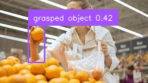
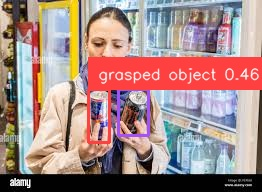

# Extracting product images using [GroundingDINO](https://github.com/IDEA-Research/GroundingDINO.git) for identification.

Added a demo code which runs on a image and detects produts. Final code runs on a video which is like frames coming from cctv and the code extract products, people are holding.

- GroundingDINO is an advanced vision-language model designed for object detection and segmentation tasks. It combines image and text inputs to detect objects in images based on specific prompts. By grounding the understanding of objects in both visual and textual information, GroundingDINO excels in identifying and localizing objects that match the given description. This model is particularly useful in applications where precise, text-driven object detection is required, such as extracting relevant objects from images for further processing, like product identification.

- The first [demo groundingdino_demo.py](groundingdino_demo.py) shows how to use GroundingDINO for object detection in static images, specifically focusing on people holding products. The demo walks through the process of applying GroundingDINO to a series of images where individuals are holding various items. GroundingDINO was able to successfully detect and isolate the products held by the individuals, highlighting its precision in product identification tasks.

      

- The second [demo product_extract_demo.py](product_extract_demo.py) takes the implementation a step further by applying GroundingDINO to video footage, simulating a real-life example of a CCTV feed from a store or mall. This demo highlights GroundingDINO’s ability to handle more complex and dynamic environments, making it a powerful tool for video-based product detection and surveillance applications. A good prompt and better thresholds (BOX_THRESHOLD and TEXT_THRESHOLD) can lead to a excellent result. Please see complete video in the [output directory](asset/outputs).

  