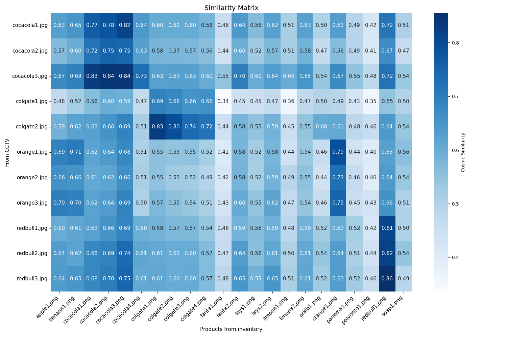
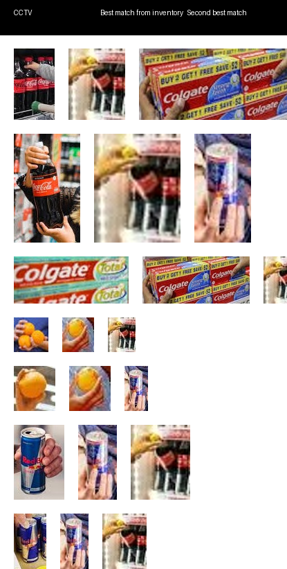
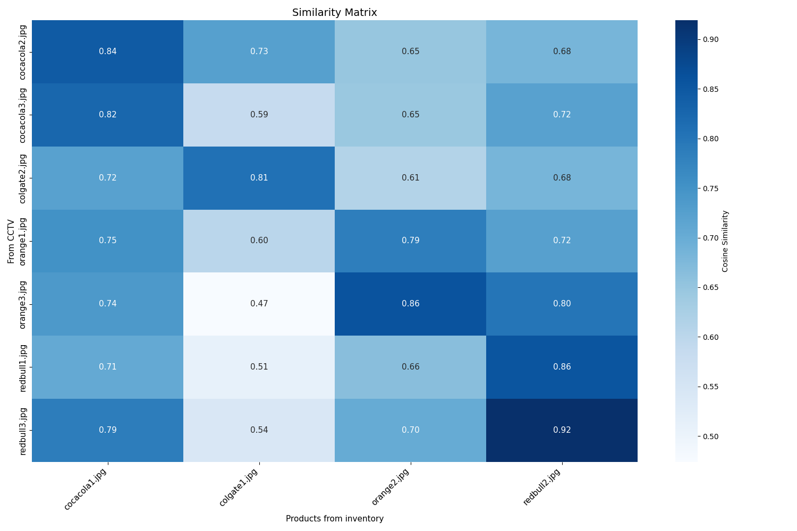

# Product identification in a mall or a grocery store.

- To identify products in a store, this repository utilizes a CLIP model that generates feature embeddings for various items. By leveraging cosine similarity, the model compares these embeddings against a database of pre-saved features from the store inventory to accurately identify products. The implementation specifically employs several versions of CLIP, including CLIP-ViT-L-14, CLIP-ViT-B-16, and CLIP-ViT-B-32, for generating these product embeddings.

- However, prior preprocessing is essential. The process begins by detecting and identifying each person in the scene, assigning them a unique ID. Once individuals are [identified](https://github.com/LokeshBorawar/LA-Transformer.git), the next step is to capture images of the products ([using GroundingDINO](GroundingDINO/README.md)) they hold, as the model requires product images for recognition. This task can be challenging. Alternatively, the system can utilize cameras in shopping baskets or monitor items at checkout to obtain product images, thereby streamlining the identification process. For demonstration purposes, products in the frames captured by [CCTV](CCTV) are manually [cropped](Demo1/zoom).

- In [Demo 1](Demo1), inventory images are sourced from the [Foodi-ML](https://github.com/Glovo/foodi-ml-dataset.git) dataset, ensuring that each product image is of higher resolution than the zoomed CCTV images. In contrast, [Demo 2](Demo2) involves a similar technique for both the inventory images and the zoomed CCTV images, where both sets are zoomed in on the products, resulting in lower resolution. This approach highlights the differences in image quality and emphasizes the challenges faced in accurately identifying products from varying sources.

- Please see all results from evey CLIP model, below are just from CLIP-ViT-L-14.
- These are Demo1 results. The first shows which two of the best inventory images match the product. And, the second one shows the similarity matrix of the product to all inventory items.

  

  

- These are Demo2 results.

  

  
 

## Contacts:
- borawarlokesh26@gmail.com

## Credits:
- [foodi-ml-dataset](https://github.com/Glovo/foodi-ml-dataset.git)
- [GroundingDINO](https://github.com/IDEA-Research/GroundingDINO.git)
- Video used in GroundingDINO demo:
  - [https://www.youtube.com/watch?v=KMJS66jBtVQ&t=1s](https://www.youtube.com/watch?v=KMJS66jBtVQ&t=1s)
- Images used in Product-Identification demo:
  - [cocacola1.jpg](https://www.google.com/imgres?q=person%20buying%20cocacola&imgurl=https%3A%2F%2Fwww.shutterstock.com%2Fimage-photo%2Fman-taking-bottle-coca-cola-600nw-1492652123.jpg&imgrefurl=https%3A%2F%2Fwww.shutterstock.com%2Fsearch%2Fbuying-coke&docid=j02XT3CQwtSrRM&tbnid=fL2eoH5HAk6fFM&vet=12ahUKEwilu-av7tiIAxUubfUHHWVrDUIQM3oECB4QAA..i&w=600&h=400&hcb=2&ved=2ahUKEwilu-av7tiIAxUubfUHHWVrDUIQM3oECB4QAA)
  - [cocacola2.jpg](https://www.google.com/imgres?q=person%20buying%20cocacola&imgurl=https%3A%2F%2Fi0.wp.com%2Fwww.retaildetail.eu%2Fwp-content%2Fuploads%2Fsites%2F2%2F2022%2F04%2Fshutterstock_2085005953.jpg%3Ffit%3D%252C%26quality%3D100%26strip%3Dall%26ssl%3D1&imgrefurl=https%3A%2F%2Fwww.retaildetail.eu%2Fnews%2Ffood%2Fcoca-cola-gemiddeld-7-duurder-geworden%2F&docid=uYkayqKU-fj5LM&tbnid=LHIa8M7dsiJLfM&vet=12ahUKEwilu-av7tiIAxUubfUHHWVrDUIQM3oECDQQAA..i&w=1000&h=667&hcb=2&ved=2ahUKEwilu-av7tiIAxUubfUHHWVrDUIQM3oECDQQAA)
  - [cocacola3.jpg](https://www.google.com/imgres?q=person%20buying%20cocacola&imgurl=https%3A%2F%2Fwww.shutterstock.com%2Fimage-photo%2Fbangkok-thailand-june-20-2018-600nw-1261167349.jpg&imgrefurl=https%3A%2F%2Fwww.shutterstock.com%2Fsearch%2Fbuying-coke&docid=j02XT3CQwtSrRM&tbnid=1ocYNbK2tp3LmM&vet=12ahUKEwilu-av7tiIAxUubfUHHWVrDUIQM3oECGcQAA..i&w=600&h=409&hcb=2&ved=2ahUKEwilu-av7tiIAxUubfUHHWVrDUIQM3oECGcQAA)
  - [colgate1.jpg](https://www.google.com/imgres?q=person%20buying%20colgate&imgurl=https%3A%2F%2Fbsmedia.business-standard.com%2F_media%2Fbs%2Fimg%2Farticle%2F2021-05%2F21%2Ffull%2F1621564093-5977.jpg&imgrefurl=https%3A%2F%2Fwww.business-standard.com%2Farticle%2Fcompanies%2Fcolgate-india-meets-distributors-body-to-sort-out-issue-of-price-parity-122010600075_1.html&docid=Fgep_KgbvZireM&tbnid=WHEpPWudXMJHEM&vet=12ahUKEwj_wL2F7tiIAxWvfvUHHauBAcQQM3oECG0QAA..i&w=620&h=464&hcb=2&ved=2ahUKEwj_wL2F7tiIAxWvfvUHHauBAcQQM3oECG0QAA)
  - [colgate2.jpg](https://www.google.com/imgres?q=person%20buying%20colgate&imgurl=https%3A%2F%2Fwww.nairtejas.com%2Fwp-content%2Fuploads%2F2013%2F06%2Ftoothpaste-anxiety.jpg&imgrefurl=https%3A%2F%2Fwww.nairtejas.com%2Farticles%2Fi-can-never-understand-them-toothpaste-commercials%2F&docid=jPyw-B20hJKkIM&tbnid=Mr_nCbiGEON80M&vet=12ahUKEwj_wL2F7tiIAxWvfvUHHauBAcQQM3oECBcQAA..i&w=1023&h=685&hcb=2&ved=2ahUKEwj_wL2F7tiIAxWvfvUHHauBAcQQM3oECBcQAA)
  - [orange1.jpg](https://www.google.com/imgres?q=person%20buying%20orange&imgurl=https%3A%2F%2Fstatic2.bigstockphoto.com%2F4%2F5%2F3%2Flarge1500%2F354148337.jpg&imgrefurl=https%3A%2F%2Fwww.bigstockphoto.com%2Fimage-354148337%2Fstock-photo-young-man-buying-fruits-in-grocery-store-focused-young-man-standing-with-shopping-trolley-and-choos&docid=7v9Hu_cj9-yoiM&tbnid=2uUHjMXYgBeZpM&vet=12ahUKEwjgu6zM7NiIAxXkcGwGHVQ0FM4QM3oECBoQAA..i&w=1000&h=1620&hcb=2&ved=2ahUKEwjgu6zM7NiIAxXkcGwGHVQ0FM4QM3oECBoQAA)
  - [orange2.jpg](https://www.google.com/imgres?q=person%20buying%20orange&imgurl=https%3A%2F%2Fmedia.gettyimages.com%2Fid%2F463246775%2Fphoto%2Fblack-couple-shopping-at-outdoor-market.jpg%3Fs%3D612x612%26w%3Dgi%26k%3D20%26c%3DiaFQHWj3OLvJq0VxHJ8huB-TpLSGBBhlejPNwnW_oqU%3D&imgrefurl=https%3A%2F%2Fwww.gettyimages.com%2Fphotos%2Fman-holding-oranges&docid=YcAZGOUSAwCfyM&tbnid=i-BJdkh_3ONXCM&vet=12ahUKEwjgu6zM7NiIAxXkcGwGHVQ0FM4QM3oECH8QAA..i&w=408&h=612&hcb=2&ved=2ahUKEwjgu6zM7NiIAxXkcGwGHVQ0FM4QM3oECH8QAA)
  - [orange3.jpg](https://www.google.com/imgres?q=person%20buying%20orange&imgurl=https%3A%2F%2Fwww.shutterstock.com%2Fshutterstock%2Fvideos%2F1102126733%2Fthumb%2F9.jpg%3Fip%3Dx480&imgrefurl=https%3A%2F%2Fwww.shutterstock.com%2Fvideo%2Fsearch%2Forange-retail&docid=AUUhMPG5gy9T4M&tbnid=h4InWNoEH3BkrM&vet=12ahUKEwjgu6zM7NiIAxXkcGwGHVQ0FM4QM3oECHQQAA..i&w=480&h=270&hcb=2&ved=2ahUKEwjgu6zM7NiIAxXkcGwGHVQ0FM4QM3oECHQQAA)
  - [redbull1.jpg](https://manmatters.com/blog/is-red-bull-alcohol/)
  - [redbull2.jpg](https://www.google.com/imgres?q=person%20buying%20redbull&imgurl=https%3A%2F%2Fc8.alamy.com%2Fcomp%2FFCFE6X%2Fwoman-shopping-for-energy-drinks-in-supermarket-FCFE6X.jpg&imgrefurl=https%3A%2F%2Fwww.alamy.com%2Fstock-photo%2Fred-bull-drinks.html%3Fpage%3D4&docid=6TUF-ByIG2PqJM&tbnid=30X9mgmNpDOOYM&vet=12ahUKEwjP-J6J7diIAxXFXmwGHcRZFfYQM3oECFoQAA..i&w=1300&h=956&hcb=2&itg=1&ved=2ahUKEwjP-J6J7diIAxXFXmwGHcRZFfYQM3oECFoQAA)
  - [redbull3.jpg](https://yourteenmag.com/health/energy-drinks-and-teens)